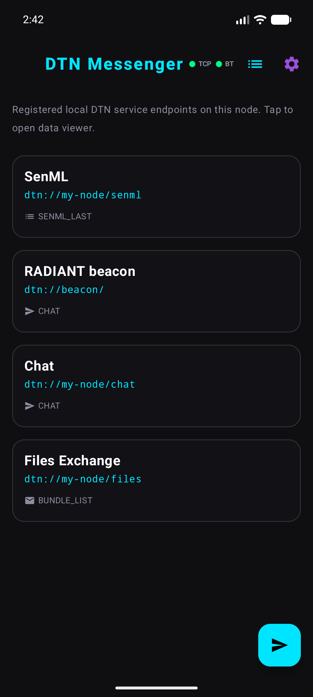
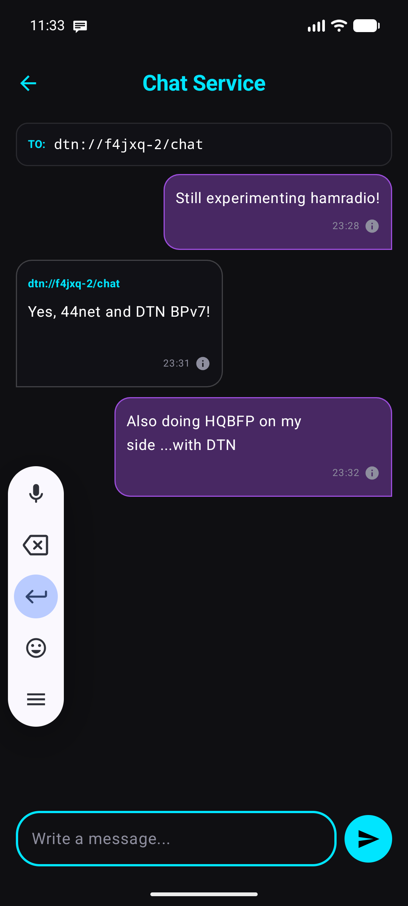
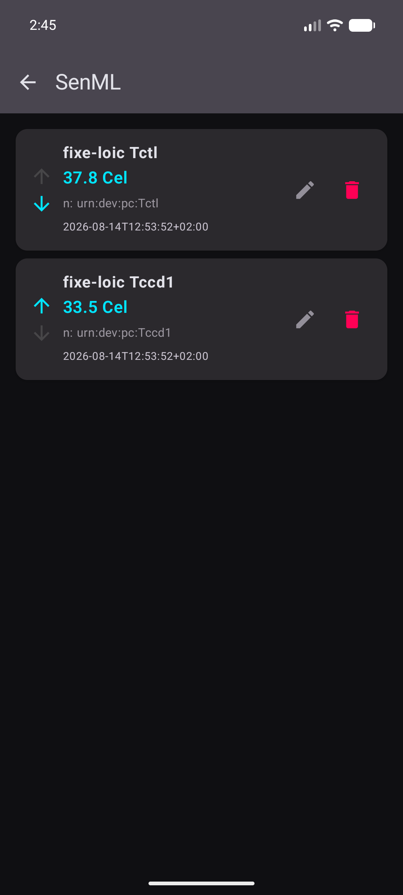
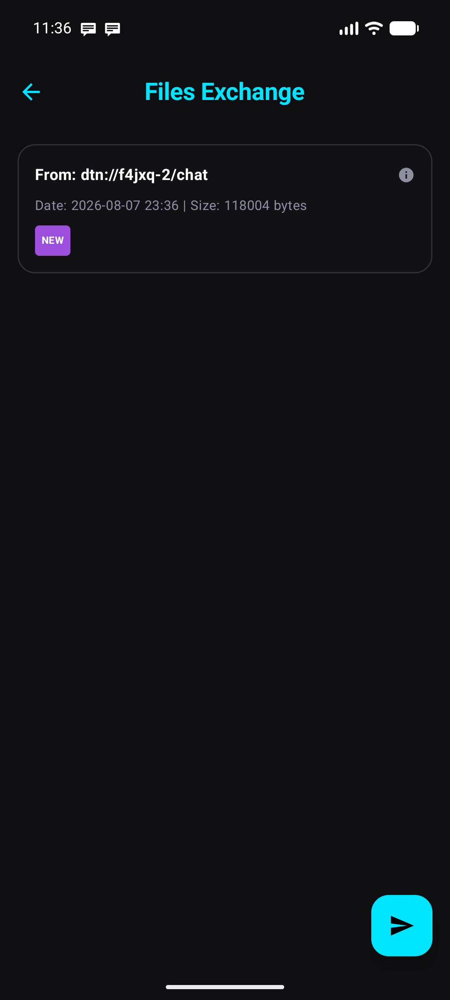
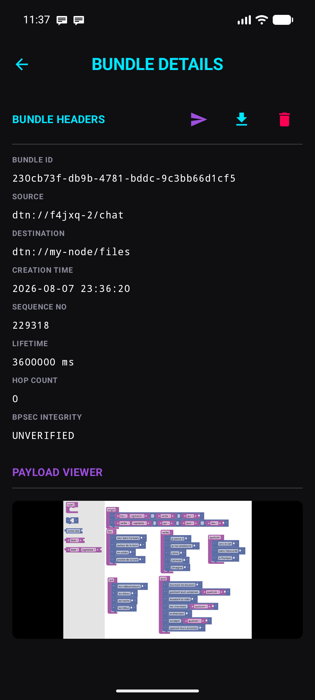
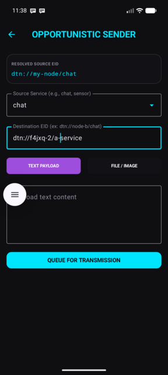
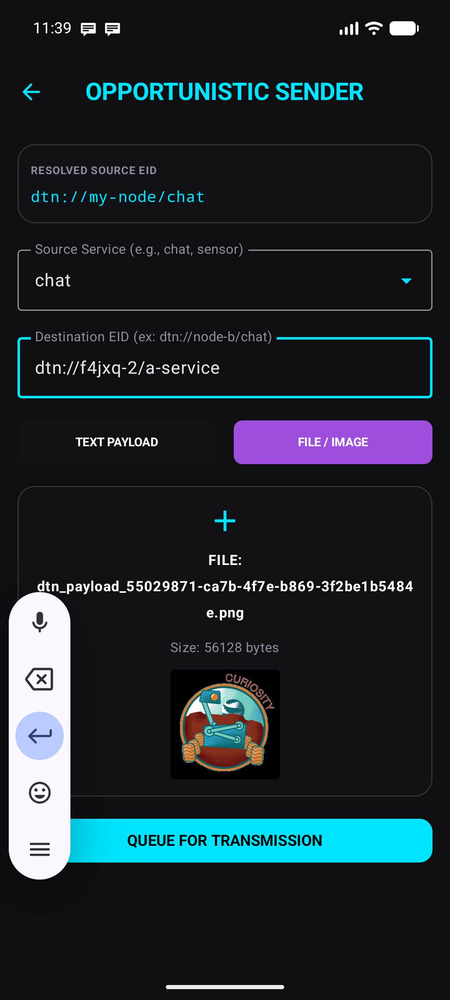
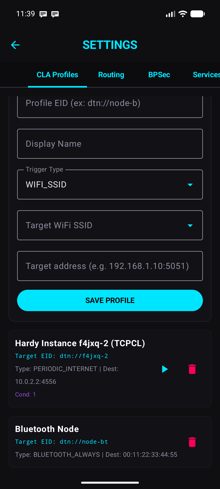
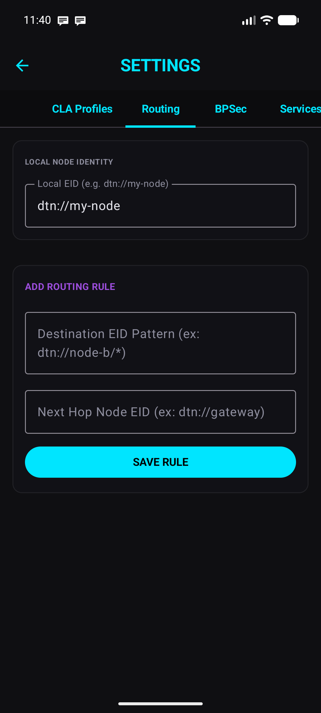
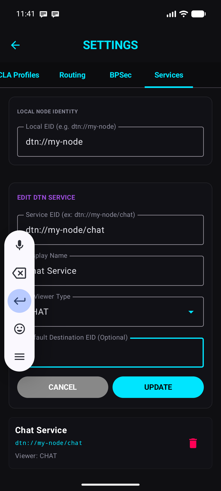

# DTN-Android BPv7 Messenger

An Android native Delay/Disruption-Tolerant Networking (DTN) messaging and autonomous store-and-forward bundles transfer application built in **Kotlin** conforming to **RFC 9171 (BPv7)** and **RFC 9103 (BPSec BIB HMAC-SHA256)**.

It is inspired by [picoD3TN](https://gitlab.com/d3tn/picod3tn) and [Hardy](https://github.com/ricktaylor/hardy/)
with stimulations from the [RADIANT project](https://radiant.amsat-uk.org/).

---

## Main features

* Services:
  * Chat view
  * Bundles list + bundle detail. Note that images and Markdown are automatically recognized.
* Android Auto
* Registred as Android File sharing
* Convergence Layer (CLA):
  * TCPCLv4 (tested against Hardy)
  * Bluetooth (simple & dummy in-house)
* Routing:
  * Next hop forwading, aka static routes
* BPSec:
  * BIB HMAC-SHA256 (RFC 9103) only so as to not have encryption as I want to connect over hamradio as per regulation requirements.
  * Configurable policy: no check, warn, strict
* Tunneling & Encapsulation:
  * Bundle-in-Bundle Encapsulation (BIBE) support (draft-ietf-dtn-bibect).
  * Automatic decapsulation of incoming administrative records (type 64443) and raw encapsulated bundles.
  * Outgoing tunnel encapsulation by prefixing next-hop EIDs with `bibe:` in routing rules.

---

## Screenshots

Here are screenshots of the application showcasing its main features:












---

## Current Limitations & Design Trade-offs

To remain lightweight, memory-efficient, and easy to maintain on mobile and embedded Android devices (API 23+), the convergence layer implementation deliberately opts for simplicity rather than full-blown complex streaming architectures:

1. **Single-Segment Transfers (No Multi-Segment Streaming)**:
   * Bundles are transmitted and received in single whole segments with `START | END` flags (`0x03`).
   * Bundles exceeding the remote node's segment MTU are not split into multi-segment streams, keeping memory buffers small and avoiding multi-fragment reassembly buffers.
2. **Sequential Half-Duplex Sessions (No Full-Duplex Multiplexing)**:
   * Sessions transmit and pull bundles sequentially rather than running independent full-duplex pipelined read/write workers. This avoids concurrency deadlocks, mutex contention, and high background CPU usage.
3. **Passive Keepalive Handling (No Active Heartbeat Timers)**:
   * Keepalive frames from remote peers are parsed and accepted, but the application does not maintain an active timer emitting outbound `KEEPALIVE` frames during idle periods, relying instead on opportunistic transfers and read timeouts.
4. **On-Demand Ephemeral Connections (No Persistent Connection Pooling)**:
   * Outbound syncs establish on-demand TCP and Bluetooth sockets that close after draining the queues, preserving battery life and radio sleep cycles on mobile devices instead of maintaining persistent pooled connections.
5. **Cleartext Only (No TLS)**:
   * Designed for direct amateur radio / peer-to-peer operations where encryption is either prohibited by regulations (e.g. ITU Article 25) or adds unnecessary handshake overhead.

> [!NOTE]
> **Strict Responsibility Transfer**: While keeping the network state machine simple, the convergence layers strictly adhere to DTN responsibility transfer principles: an acknowledgement (`XFER_ACK` in TCPCLv4 or RFCOMM ACK in Bluetooth) is **never sent prematurely**. Acknowledgements are only emitted over the wire once the incoming bundle has passed all checks, its payload is written to persistent disk storage, and its record is securely committed to the local database.

---

## 1. HOW TO IMPORT & TEST IN ANDROID STUDIO

Your Android Studio installation is located at `/home/loic/download/android-studio`.

### Step 1: Launch Android Studio
Open a terminal and run the launcher script:
```bash
/home/loic/download/android-studio/bin/studio.sh &
```

### Step 2: Import the Project
1. In the Android Studio welcome screen, click **Open** (or go to **File > Open**).
2. Select the directory: `/home/loic/projets/dtn-android-messenger`.
3. Click **OK**.
4. Android Studio will automatically run Gradle sync (using the Java 21 JDK and the local settings configured in Android Studio).

---

## 2. HOW TO LAUNCH AN EMULATOR

### Option A: From Android Studio (Recommended)
1. In Android Studio, open the **Device Manager** (icon in the top-right toolbar or **Tools > Device Manager**).
2. If you have an existing virtual device (AVD), click the **Play** button next to it to start it.
3. If none exist, click **Create Device**, select a phone model (e.g., Pixel 7), choose a system image (API Level 26+), and click **Finish**. Then start the emulator.
4. Click the green **Run** button in the main toolbar to compile and install the application onto the running emulator.

### Option B: From the Command Line (CLI)
You can launch an emulator directly from your terminal using the Android SDK binaries:
```bash
# 1. List available virtual devices
~/Android/Sdk/emulator/emulator -list-avds

# 2. Start the emulator (replace <AVD_NAME> with one from the list)
~/Android/Sdk/emulator/emulator -avd <AVD_NAME> &

# 3. Once the emulator is booted, compile and install the app
./gradlew installDebug
```

---

## 3. HOW TO TEST WITH YOUR HARDY INSTANCE (`dtn://f4jxq-2` on Port 4556)

The application database is pre-populated with a convergence profile specifically for this scenario:

*   **Pre-populated Target Profile:**
    *   **EID:** `dtn://f4jxq-2`
    *   **Adapter:** TCPCLv4
    *   **Target Address:** `10.0.2.2:4556`

> [!NOTE]
> `10.0.2.2` is a special loopback IP address mapped by the Android Emulator to access the host machine's loopback (`127.0.0.1`). When the app connects to `10.0.2.2:4556`, it communicates directly with your Hardy instance listening on port `4556` on the host machine.

### Testing steps:
1.  **Start your Hardy instance** on the host machine, ensuring it is listening on port `4556` using its TCPCLv4 convergence adapter.
2.  **Open the DTN Messenger app** on the emulator.
3.  **Configure Local Node Name (Optional):**
    *   Go to settings (gear icon in the top right of the EID registry screen).
    *   Tap the **SERVICES** tab.
    *   Under **Local Node Configuration**, you can view or modify the local Node EID base (defaults to `dtn://my-node`). This is saved persistently.
4.  **Send a Bundle:**
    *   Go back to the registry screen and tap the Floating Action Button (**+**) in the bottom-right corner to open the **Opportunistic Sender**.
    *   The screen displays the **Resolved Source EID** (derived by concatenating the local Node EID and your service name, e.g., `dtn://my-node/chat`).
    *   **Source Service:** Manually type your service name (e.g. `chat` or `sensor`). Alternatively, tap the dropdown arrow on the right to select from the registered local services, which will automatically fill in the service part. If the list is empty, you can still type it manually.
    *   **Destination EID:** Type `dtn://f4jxq-2/chat` (or another path targeting your Hardy instance).
    *   **Payload text content:** Write your test message.
5.  Tap **QUEUE FOR TRANSMISSION**.
6.  The bundle is generated, signed (if you register a BPSec key for the destination under Settings), and placed in the `OUTBOX` queue.
7.  The background flusher runs automatically every 10 seconds. You can monitor the status in real time:
    *   Go back to the registry screen and tap the **Logs** button (list icon in the top right).
    *   You will see logs such as:
        *   `[TCPCL] Connecting to 10.0.2.2:4556`
        *   `[TCPCL] Successfully sent bundle, acknowledged X bytes`
        *   `Bundle successfully sent! New state: DELIVERED`

---

## 4. BLUETOOTH PEER CONFIGURATION & MAC ADDRESSES

To establish peer-to-peer communication between two devices via Bluetooth, you must configure the destination device's Bluetooth MAC address in the convergence profiles of the sending device.

### How to Find Your Bluetooth MAC Address on Android:
1. Open the Android **Settings** app.
2. Scroll down and tap **About phone** (or **About tablet** / **About device**).
3. Select **Status** or **Status information**.
4. Look for **Bluetooth address** (e.g., `04:29:2E:CF:DF:B4`).
   > [!IMPORTANT]
   > Programmatic access to a device's own Bluetooth MAC address is restricted by Android (since API 23+ / Android 6.0) for privacy reasons, returning a dummy `02:00:00:00:00:00`. You must manually read this address from the device settings and enter it into the profile configuration screen of the peer.

### Default Database Pre-populated Values:
If the application starts with a clean database, it will automatically populate the following default configurations:
* **Local Services**:
  * `dtn://my-node/chat` (Default Chat Service)
  * `dtn://my-node/files` (Default File Exchange)
* **Convergence Profiles**:
  * `dtn://f4jxq-2` : Pointing to `10.0.2.2:4556` (representing the host PC loopback from the emulator via TCPCL)
  * `dtn://node-bt` : Pointing to a dummy Bluetooth MAC address `00:11:22:33:44:55` (edit this in the **Profiles Config** tab of settings to match your remote phone's actual address).

---

## 5. SECURITY & AMATEUR RADIO REGULATORY COMPLIANCE

This application is specifically designed to comply with **Amateur Radio (Ham Radio) regulations** (such as ITU Article 25 and FCC Part 97 rules):
*   **No Payload Encryption:** Obscuring the meaning of messages (encryption) is legally prohibited on amateur bands. Therefore, this implementation **does not and will not support payload encryption** (BPSec BCB - Block Confidentiality Block).
*   **Integrity & Authentication Only:** We utilize BPSec BIB (Block Integrity Block) with HMAC-SHA256 signatures. This ensures message integrity (detecting transmission errors or tampering) and source authentication (preventing spoofing) while keeping the payload in plain text, making it 100% compliant with cleartext regulations.
*   **No TLS on Amateur Links:** Transport-layer encryption (TLS) on TCPCLv4 connections is disabled to comply with cleartext requirements on ham radio links.

---

## 6. PRIVACY POLICY (GDPR / RGPD COMPLIANCE)

This application is 100% decentralized and respects your privacy:
*   **Zero Data Collection:** No personal data, telemetry, analytics, location logs, or messaging metadata are collected, stored, or transmitted to any central servers or third parties.
*   **Strictly Local Storage:** All chat logs, contacts, routes, cryptographic keys, and application configurations are stored locally on your device in a secure database sandbox (Room DB and EncryptedSharedPreferences).
*   **Decentralized Sync:** When syncing over TCP or Bluetooth, data is exchanged directly peer-to-peer (P2P) between your device and the destination/next-hop node.

---

## 7. ANDROID PERMISSIONS JUSTIFICATION

To perform opportunistic synchronization and core services, the application requires the following Android permissions:
*   **Bluetooth Permissions (`BLUETOOTH_CONNECT`, `BLUETOOTH`, `BLUETOOTH_ADMIN`):** Required to connect to and communicate with Bluetooth Classic peers for store-and-forward bundle transfers. *No location permission is required as we connect directly to designated MAC addresses without active network discovery scanning.*
*   **Audio Recording (`RECORD_AUDIO`):** Required to record voice messages for the chat service.
*   **Foreground Service (`FOREGROUND_SERVICE`, `FOREGROUND_SERVICE_CONNECTED_DEVICE`):** Required to run `DtnEngineService` persistently as a background service to handle connection sockets and bundle queue flushes.
*   **Notifications (`POST_NOTIFICATIONS`):** Required on Android 13+ to display the status sync notification for the foreground service.


---

## 8. CODE VERIFICATION & TESTING

To run the local unit test suite (covering BPv7 parser, block serializers, and BPSec HMAC validation):
```bash
./gradlew test
```
The test task compiles the modules and runs the tests in `Bpv7Test.kt` and `PayloadUtilsTest.kt`.

