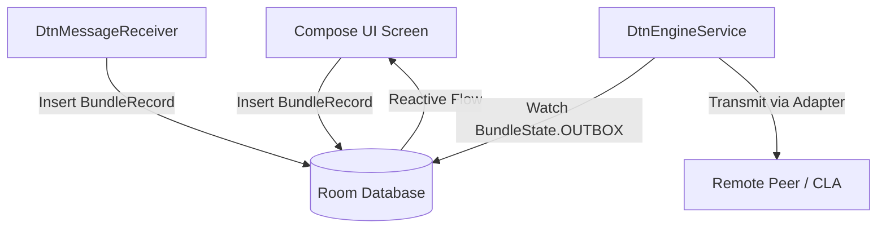

# Architecture Guide

This document outlines the core architectural components and data flow patterns of the DTN Messenger app.

## 1. Core Architecture & Design Patterns

The application follows clean architecture principles tailored for Android, organized around a persistent background engine and a reactive UI:

* **Foreground Service Pattern**: [`DtnEngineService`](../app/src/main/java/com/dtn/messenger/service/DtnEngineService.kt) acts as the central engine. It runs as a foreground service to maintain socket listeners and manage background synchronization.
* **Convergence Layer Pattern**: Network protocols are decoupled using the [`ConvergenceLayerAdapter`](../app/src/main/java/com/dtn/messenger/cla/ConvergenceLayer.kt#L10) interface.
  - [`TcpClAdapter`](../app/src/main/java/com/dtn/messenger/cla/ConvergenceLayer.kt#L15) manages TCPCLv4 connections using Ktor Network.
  - [`BluetoothClassicAdapter`](../app/src/main/java/com/dtn/messenger/cla/ConvergenceLayer.kt#L391) handles peer-to-peer RFCOMM channels.
* **MVVM with Jetpack Compose**: The user interface is built reactively. ViewModels or state-holders collect Kotlin Flows from Room DAOs to update the UI automatically.

---

## 2. Data Flow

Data flows asynchronously through the Room database, serving as the single source of truth:

### 2.1 Outbound Flow (Sending)
1. **Creation**: When the user sends a message, a [`BundleRecord`](../app/src/main/java/com/dtn/messenger/data/model/Entities.kt#L19) is constructed with state `BundleState.OUTBOX` and stored in the database.
   - For UI composition, see [`ChatScreen.kt` (lines 300-308)](../app/src/main/java/com/dtn/messenger/ui/ChatScreen.kt#L300-L308).
   - For notification direct reply, see [`DtnMessageReceiver.kt` (lines 42-56)](../app/src/main/java/com/dtn/messenger/receiver/DtnMessageReceiver.kt#L42-L56).
2. **Triggering**: The active component calls `ContextCompat.startForegroundService` with action `FLUSH_QUEUE` to notify the engine.
3. **Queue Processing**: [`DtnEngineService.flushQueue()`](../app/src/main/java/com/dtn/messenger/service/DtnEngineService.kt#L490) reads the database, signs the bundles with BPSec key if configured, selects the matching adapter (TCP or Bluetooth), and transmits the payload.
4. **State Transition**: Upon successful transmission, the database state of the record is updated to `BundleState.DELIVERED`.

### 2.2 Inbound Flow (Receiving)
1. **Socket Listeners**: [`BluetoothClassicAdapter`](../app/src/main/java/com/dtn/messenger/cla/ConvergenceLayer.kt#L459) and [`TcpClAdapter`](../app/src/main/java/com/dtn/messenger/cla/ConvergenceLayer.kt#L36) listen continuously.
2. **Parsing**: Received raw bytes are parsed into a [`Bundle`](../app/src/main/java/com/dtn/messenger/protocol/Bpv7.kt#L9) structure using [`Bpv7Parser`](../app/src/main/java/com/dtn/messenger/protocol/Bpv7.kt#L110).
3. **Insertion**: The parsed bundle is inserted into the local database as `BundleState.RECEIVED`.
4. **Responsibility Transfer**: Only after successful verification, payload disk write, and database insertion is `XFER_ACK` returned to the CLA peer.
5. **UI Notification**: The UI automatically updates by observing the database flow (e.g. in [`RegistryScreen.kt`](../app/src/main/java/com/dtn/messenger/ui/RegistryScreen.kt)).

---

## 3. DTN EID Addressing: BPv7 Source EID vs. CLA Node ID

A critical architectural distinction must be maintained between the Bundle Protocol layer and the Convergence Layer Adapters:

* **BPv7 Bundle Source EID (`primaryBlock.source`)**:
  - Identifies the specific application endpoint originating the bundle at the BP layer.
  - Sourced directly from [`LocalService.serviceEid`](../app/src/main/java/com/dtn/messenger/data/model/Entities.kt#L50) (e.g. `dtn://station-1/chat`, sub-service aliases, or encapsulated transit EIDs).
  - **Never forcibly rewrite or conflate this with the CLA node ID**. In delay-tolerant topologies, nodes can host multiple distinct service endpoints, bridge different networks, or route/encapsulate bundles on behalf of other endpoints (`dtnbib` / BIBE tunneling).
* **CLA Node ID (`SESS_INIT` Node ID)**:
  - Identifies the physical transport peer establishing the convergence layer connection (e.g. `dtn://f4jxq-9`).
  - Used for transport session establishment, keepalive management, and neighbor route registration in adjacent BPAs.
